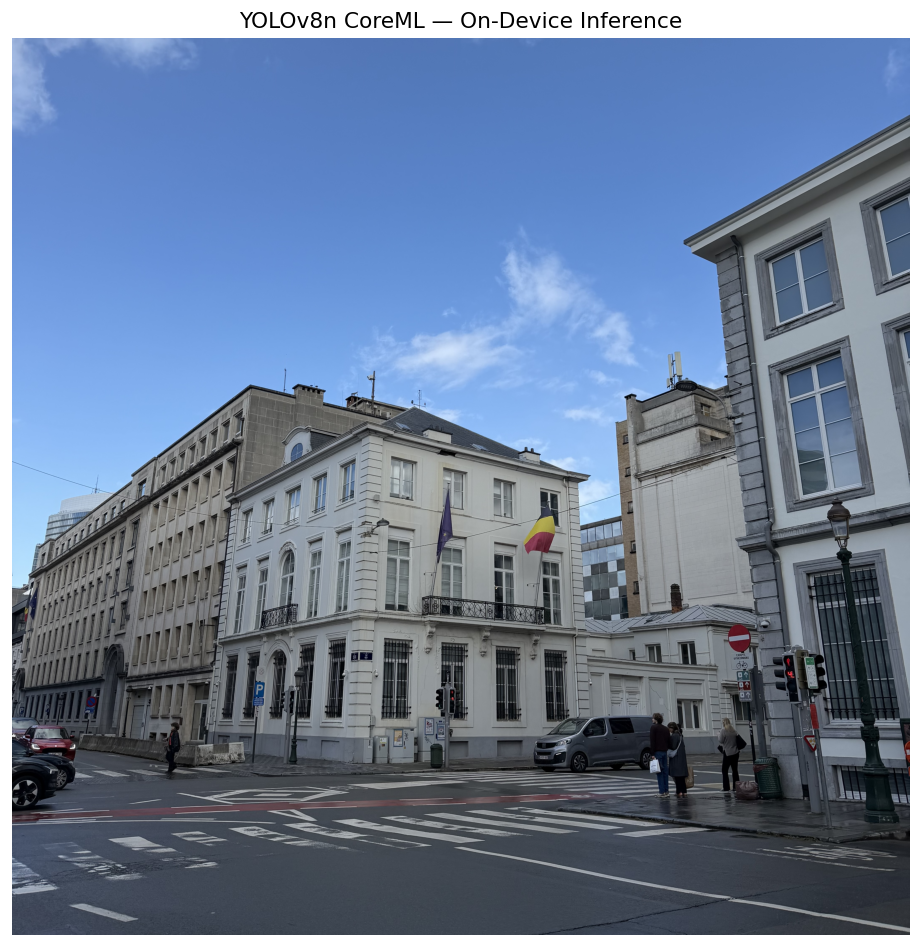

# Live Object Detector

Object detection on iPhone using DETR and YOLOv8 — bounding box prediction with class labels and confidence scores, exported to CoreML for on-device inference.

---

## Dataset

**COCO 2017 (Common Objects in Context)**

80 everyday object classes — people, animals, vehicles, food, furniture, electronics, and more.

- 118k training images, 5k validation images
- Each image contains multiple objects, each annotated with a bounding box and class label
- Annotation format: `[x, y, width, height]` (top-left corner + size)

Unlike scene classification (one label per image), COCO requires the model to find *where* each object is and *what* it is — simultaneously.

---

## Models

Two models are studied: DETR to understand transformer-based detection, YOLOv8 for deployment.

**DETR (Detection Transformer)** — Facebook AI, 2020
- First end-to-end object detector using a pure transformer
- No anchors, no NMS — uses bipartite matching to assign predictions to ground truth
- Encodes the image with a CNN backbone, then uses a transformer encoder-decoder with 100 learned object queries to predict boxes directly
- 41M parameters — too large for real-time on-device inference

**YOLOv8** — Ultralytics, 2023
- State-of-the-art real-time detector — "You Only Look Once"
- CNN-based with anchor-free detection head and NMS post-processing
- 3.2M parameters — designed for on-device inference
- Industry standard for production CV systems

| | DETR | YOLOv8n |
|---|---|---|
| Architecture | Transformer | CNN |
| Parameters | 41M | 3.2M |
| Speed | Slower | Fast (real-time) |
| CoreML export | Fails (dynamic control flow) | One line |
| Use in this project | Notebooks — architecture study | iPhone app — deployment |

**Why DETR can't export to CoreML:** The Hungarian matching algorithm used during training contains dynamic control flow that `torch.jit.trace` cannot handle. YOLOv8 has a fixed computation graph and exports cleanly.

---

## Notebooks

| Notebook | Description |
|---|---|
| `01_detr_architecture.ipynb` | DETR internals: encoder-decoder transformer, bipartite matching, Hungarian algorithm |
| `02_yolov8_inference.ipynb` | YOLOv8 on COCO — anchor-free detection, mAP evaluation, IoU |
| `03_detection_visualization.ipynb` | Bounding box visualization, attention maps, NMS explained |
| `04_coreml_export.ipynb` | Export YOLOv8 to CoreML, latency benchmark on Apple Neural Engine |

---

## Results

### DETR — Transformer-Based Detection

DETR encodes the image with a ResNet-50 backbone, then uses a transformer encoder-decoder with 100 learned object queries to predict bounding boxes directly — no anchors, no NMS.

**Cross-attention maps** show which image regions each object query attends to when predicting its box. Each query specializes to a different spatial area:

---

### YOLOv8 — Anchor-Free CNN Detection

YOLOv8 divides the image into a grid and predicts boxes at each cell using an anchor-free detection head. NMS filters overlapping predictions.

---

### DETR vs YOLOv8

Same image, both models. The panel titles show the key difference:

DETR produces 18 boxes — but 9 of them are street lamps misclassified as *traffic light* and arms misclassified as *handbag*. YOLOv8 produces 10 cleaner detections with no such false positives on this scene. Both models have the same underlying limitation — they can only predict the 80 COCO classes — but YOLOv8's detection head produces fewer spurious matches on objects that loosely resemble a known class.

Combined with 13× fewer parameters and a clean CoreML export, YOLOv8 is used for all practical inference. DETR is studied for its architecture — the first end-to-end detector with no anchors and no NMS.

---

### Detection Concepts

**Confidence thresholds** control how many boxes are shown. Lower threshold = more boxes but more noise:

**Non-Maximum Suppression (NMS)** removes duplicate overlapping boxes, keeping only the highest-confidence detection per object:

**Detection across diverse scenes** — YOLOv8n applied to varied real-world photos, showing the model generalizes across object types and contexts:

**COCO class distribution** across the sample images — person and car dominate outdoor scenes, while indoor scenes surface food and tableware classes:

---

### CoreML Export — Latency Benchmark

YOLOv8n exported to CoreML (6.5 MB). Benchmarked across compute unit configurations on Apple Silicon:

| Compute Unit | Mean Latency |
|---|---|
| ALL (Neural Engine) | **4.2 ± 0.2 ms** |
| CPU_AND_NE | 4.3 ± 0.4 ms |
| CPU_ONLY | 17.0 ± 0.2 ms |

`ALL` routes to the Neural Engine automatically — ~4× faster than CPU-only. This is the config used in the iPhone app.

**End-to-end CoreML inference** — the exported model running through the full on-device pipeline: CoreML loads the `.mlpackage`, runs inference, and returns `coordinates` (N×4 normalized boxes) and `confidence` (N×80 class scores). This confirms the export is correct and the output format parses as expected before building the iPhone app.

> **Note:** The street lamp on the right is detected as *traffic light* — COCO has no street lamp class, so the model maps it to the nearest known category. This is expected when real-world objects fall outside the 80 training classes.

---

## iPhone App

Object detection running on-device via CoreML. Select a photo — the model draws bounding boxes with class labels and confidence scores.

---

## Technologies

| Technology | Used For |
|---|---|
| PyTorch + transformers | DETR architecture and inference |
| Ultralytics YOLOv8 | Detection, inference, CoreML export |
| coremltools | CoreML export and benchmarking |
| SwiftUI + PhotosUI | iOS app UI |
| CoreML | On-device inference |
