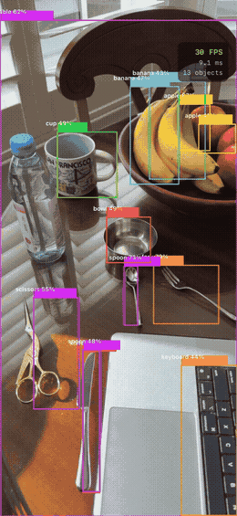
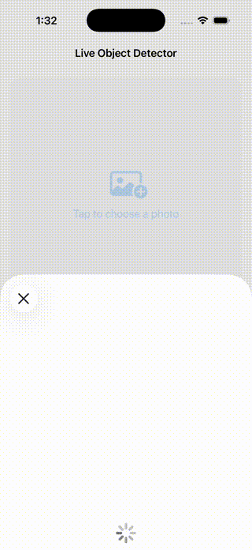

# Live Object Detector

<p align="center">
  
</p>

Real-time object detection on iPhone — YOLOv8n running on the Neural Engine at 30 FPS, bounding boxes overlaid live via `AVCaptureSession`. Point the camera at anything from the COCO 80 classes and detections appear instantly.

[Read the blog post →](https://www.preeti-chauhan.com/Live-Object-Detector/)

---

## What This Is

Two models are studied side by side: **DETR** to understand how transformers approach detection end-to-end, and **YOLOv8** for on-device deployment. The project covers the full pipeline — dataset, detection concepts, architecture comparison, CoreML export, latency benchmarking, and two iPhone apps (photo picker and live camera).

**Why two models?** DETR is architecturally the most elegant modern detector — no anchors, no NMS, pure set prediction. But it can't export to CoreML. YOLOv8 can, in one line, at 3.2M parameters. Studying both makes the deployment tradeoff concrete.

---

## Dataset

**COCO 2017 (Common Objects in Context)**

80 everyday object classes — people, animals, vehicles, food, furniture, electronics, and more.

- 118k training images, 5k validation images
- Each image contains multiple objects, each annotated with a bounding box and class label
- Annotation format: `[x, y, width, height]` (top-left corner + size)

Unlike scene classification (one label per image), COCO requires the model to find *where* each object is and *what* it is — simultaneously.

Both DETR and YOLOv8 are pretrained on COCO — no training from scratch needed.

---

## Models

Two models are studied: DETR to understand transformer-based detection, YOLOv8 for deployment.

**DETR (Detection Transformer)** — [Carion et al., 2020](https://arxiv.org/abs/2005.12872)
- First end-to-end object detector using a pure transformer
- No anchors, no NMS — uses bipartite matching to assign predictions to ground truth
- Encodes the image with a CNN backbone, then uses a transformer encoder-decoder with 100 learned object queries to predict boxes directly
- 41M parameters — too large for real-time on-device inference

**YOLOv8** — [Ultralytics, 2023](https://github.com/ultralytics/ultralytics)
- State-of-the-art real-time detector — "You Only Look Once"
- CNN-based with anchor-free detection head and NMS post-processing
- 3.2M parameters — designed for on-device inference
- Industry standard for production CV systems

| | DETR | YOLOv8n |
|---|---|---|
| Architecture | Transformer | CNN |
| Parameters | 41M | 3.2M |
| NMS needed | No (bipartite matching) | Yes |
| Speed | Slower | Fast (real-time) |
| CoreML export | Fails (dynamic control flow) | One line |
| mAP@0.5:0.95 | ~42 | ~37 |

**Why DETR can't export to CoreML:** At inference time, DETR's post-processing involves dynamic control flow — variable-length outputs and conditional masking based on confidence threshold cause `torch.jit.trace` to break, since trace records one fixed execution path and fails when output shapes change across inputs. YOLOv8 bakes NMS directly into the CoreML model as a static `NMSLayer`, giving it a fixed computation graph regardless of input.

---

## Notebooks

| Notebook | Description |
|---|---|
| `01_detr_architecture.ipynb` | DETR internals: encoder-decoder transformer, bipartite matching, Hungarian algorithm |
| `02_yolov8_inference.ipynb` | YOLOv8 on COCO — anchor-free detection, mAP evaluation, IoU |
| `03_detection_visualization.ipynb` | Bounding box visualization, attention maps, NMS explained |
| `04_coreml_export.ipynb` | Export YOLOv8 to CoreML, latency benchmark on Apple Neural Engine |
| `05_int8_export.ipynb` | INT8 quantization: size vs accuracy vs latency comparison (FP32 vs INT8) |

---

## Results

**Sample image used for detection:**


---

### DETR — Transformer-Based Detection


**Cross-attention maps** show which image regions each object query attends to when predicting its box. Each query specializes to a different spatial area:


---

### YOLOv8 — Anchor-Free CNN Detection


---

### DETR vs YOLOv8

Same image, both models. The panel titles show the key difference:


The chart below makes the difference clear:


Red bars are classes DETR detects but YOLOv8 misses — handbag (pedestrian carrying a bag, low confidence), truck (the van), stop sign. DETR also fires 8 traffic light boxes vs YOLOv8's 3, over-detecting on lamp posts. YOLOv8 produces fewer, more precise detections with 13× fewer parameters.

Combined with a clean CoreML export, YOLOv8 is used for all practical inference. DETR is studied for its architecture — the first end-to-end detector with no anchors and no NMS.

---

### Detection Concepts

**Confidence thresholds** control how many boxes are shown. Lower threshold = more boxes but more noise:


**Non-Maximum Suppression (NMS)** removes duplicate overlapping boxes, keeping only the highest-confidence detection per object:


**Detection across diverse scenes** — YOLOv8n applied to varied real-world photos, showing the model generalizes across object types and contexts:


**COCO class distribution** across the sample images — person and car dominate outdoor scenes, while indoor scenes surface food and tableware classes:


---

### CoreML Export — Latency Benchmark

YOLOv8n exported to CoreML (6.5 MB). Benchmarked across compute unit configurations on Apple Silicon:


| Compute Unit | Mean Latency |
|---|---|
| ALL (Neural Engine) | **4.7 ± 0.1 ms** |
| CPU_AND_NE | 4.6 ± 0.1 ms |
| CPU_ONLY | 18.1 ± 0.4 ms |
| PyTorch MPS | 61.6 ± 6.5 ms |

`ALL` routes to the Neural Engine automatically — ~4× faster than CPU-only. CoreML here outperforms PyTorch MPS by 13×, in contrast to app-01 where MPS was faster: YOLOv8n at 6.5 MB is small enough for the Neural Engine to route efficiently. This is the config used in the iPhone app.

End-to-end inference confirmed: CoreML loads the `.mlpackage`, runs inference, and returns `coordinates` (N×4 normalized boxes) and `confidence` (N×80 class scores). Output format verified before building the iPhone app.

---

## iPhone App

Object detection running on-device via CoreML. Select a photo — the model draws bounding boxes with class labels and confidence scores.

**Preprocessing pipeline** (equivalent to YOLOv8's resize used at export time):

```swift
// Resize UIImage to 640×640 → CVPixelBuffer (BGRA)
// CoreML receives the pixel buffer and routes it to the Neural Engine
let output = try model.prediction(image: buffer, iouThreshold: 0.45, confidenceThreshold: 0.4)
```

**Parsing output:**

```swift
// coordinates: MLMultiArray (N, 4) — normalized (cx, cy, w, h) in [0, 1]
// confidence:  MLMultiArray (N, 80) — class scores per box
let cx = output.coordinates[[i, 0] as [NSNumber]].floatValue
let cy = output.coordinates[[i, 1] as [NSNumber]].floatValue
// Convert to top-left origin: x = cx - w/2, y = cy - h/2
```

Bounding boxes are drawn directly on the image using SwiftUI `Canvas`. Each class maps to a consistent color; confidence and class label are shown in a label above each box. The detection list shows top results with confidence bars.

<p align="center">
  
</p>


---

## Live Camera App

The photo picker app above validated the CoreML pipeline end-to-end on a static input — correct output format, coordinates, and confidence scores. With that confirmed, the input source was swapped to a live camera stream.

Real-time object detection on iPhone using `AVCaptureSession` — bounding boxes update live as you move the camera, with a FPS counter and inference time overlay.

**Pipeline:**
1. `AVCaptureSession` streams 720p frames from the back camera
2. Each frame arrives as a `CVPixelBuffer` — resized to 640×640 before inference (the model's expected input size)
3. YOLOv8n runs on the Neural Engine via `computeUnits = .all`
4. Detections are overlaid using SwiftUI `Canvas` — updated on every inference result

```swift
func captureOutput(_ output: AVCaptureOutput,
                   didOutput sampleBuffer: CMSampleBuffer,
                   from connection: AVCaptureConnection) {
    guard let pixelBuffer = CMSampleBufferGetImageBuffer(sampleBuffer),
          let resized = resize(pixelBuffer, to: CGSize(width: 640, height: 640)) else { return }
    let result = try model.prediction(image: resized,
                                      iouThreshold: 0.45,
                                      confidenceThreshold: 0.4)
}
```

Inference runs every 2nd frame to prevent queue backlog. FPS and inference time are published via `@Published` and shown in a HUD overlay.

<p align="center">
  
</p>

---

## INT8 Quantization

YOLOv8n re-exported with INT8 quantization using `coremltools` — same model, 4× smaller, faster on-device.

```python
model.export(format='coreml', nms=True, int8=True)
```

| | FP32 | INT8 |
|---|---|---|
| File size | 6.5 MB | 1.7 MB |
| Mean latency (Neural Engine) | 4.7 ms | 4.2 ms |
| mAP50 (COCO val) | 0.524 | 0.521 |

Weight compression from 32-bit floats to 8-bit integers: 4× size reduction with negligible accuracy loss. The Neural Engine handles INT8 natively — a direct speed improvement on A-series chips.

See `notebooks/05_int8_export.ipynb` for the full export, latency benchmark (50 runs, 10 warmup), and side-by-side detection comparison.

---

## Insights

**DETR is architecturally elegant but impractical for on-device deployment.** Eliminating NMS via bipartite matching is a genuine innovation — but the resulting dynamic post-processing graph prevents CoreML export. For production CV, a static graph matters as much as accuracy.

**Smaller models benefit more from the Neural Engine.** YOLOv8n at 6.5 MB achieves 13× speedup over PyTorch MPS via CoreML. ViT-B/16 at 171 MB showed almost no speedup — the Neural Engine's efficiency advantage depends on model size fitting within its memory budget.

**More detections ≠ better.** DETR fires 18 boxes on the street scene vs YOLOv8's 10 — the extras include lamp posts as traffic lights. Fewer, more precise detections with a clean export make YOLOv8 the right choice for deployment.

---

## Technologies

| Technology | Used For |
|---|---|
| PyTorch + transformers | DETR architecture and inference |
| Ultralytics YOLOv8 | Detection, inference, CoreML export |
| coremltools | CoreML export and benchmarking |
| SwiftUI + PhotosUI | iOS app UI |
| AVFoundation | Live camera feed (AVCaptureSession) |
| CoreML | On-device inference |
